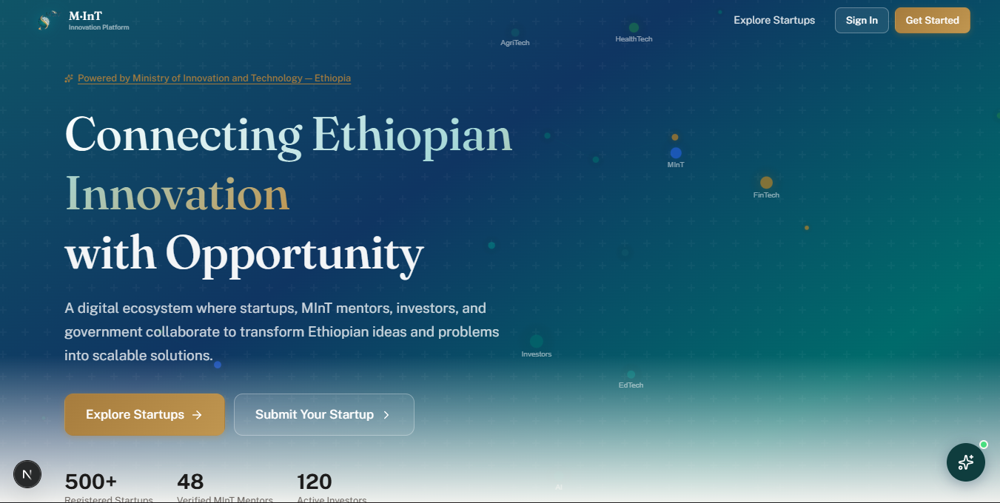

<h1 align="center"> MInT Innovation Platform </h1>

<p align="center">
  
</p>

<p align="center">
  The <strong>Ministry of Innovation & Technology (MInT) Innovation Platform</strong> is a comprehensive portal designed to oversee, manage, and foster the startup innovation ecosystem. It connects startups, mentors, and investors, providing a centralized government console for oversight, approval, and activity tracking.
</p>


## 🚀 Tech Stack

This project is built with modern, scalable web technologies:

- **Framework:** [Next.js](https://nextjs.org/) (React, App Router)
- **Language:** [TypeScript](https://www.typescriptlang.org/)
- **Styling:** [Tailwind CSS](https://tailwindcss.com/) & [Framer Motion](https://www.framer.com/motion/) (for animations)
- **UI Components:** [Radix UI](https://www.radix-ui.com/) & [Lucide Icons](https://lucide.dev/)
- **Database ORM:** [Prisma](https://www.prisma.io/)
- **Authentication:** [NextAuth.js](https://next-auth.js.org/) (Auth.js)
- **Form Handling & Validation:** [React Hook Form](https://react-hook-form.com/) & [Zod](https://zod.dev/)
- **Charts:** [Recharts](https://recharts.org/)

## 📋 Prerequisites

Before you begin, ensure you have met the following requirements:
* **Node.js**: `v18.x` or higher
* **npm** or **yarn** or **pnpm** installed
* A configured relational database (e.g., PostgreSQL, MySQL, SQLite) accessible via a connection string.

## 🛠️ Getting Started

Follow these steps to get your development environment set up:

**1. Clone the repository**
```bash
git clone <repository-url>
cd mint-platform
```

**2. Install dependencies**
```bash
npm install
# or
yarn install
```

**3. Configure Environment Variables**
Create a `.env` file in the root of your project and configure your environment variables. You will typically need:
```env
DATABASE_URL="your_database_connection_string"
NEXTAUTH_SECRET="your_nextauth_secret_key"
NEXTAUTH_URL="http://localhost:3000"
```

**4. Set up the Database**
Push the schema to your database and generate the Prisma Client:
```bash
npx prisma db push
```

If you have a seed script configured, you can populate the database with initial data:
```bash
npm run db:seed
```

**5. Start the Development Server**
```bash
npm run dev
```
Open [http://localhost:3000](http://localhost:3000) with your browser to see the application.

---

## 🗄️ Database Management

We use Prisma as our ORM. Below are the essential commands for managing your database during development.

**Update Database Schema:**
If you make changes to `prisma/schema.prisma`, sync them to your database using:
```bash
npx prisma db push
```

**Open Prisma Studio:**
To view and edit your data through a visual interface:
```bash
npx prisma studio
```

### 🧹 Clearing the Database (DANGER)

During development, you may need to wipe your database clean and start over. 

**Option 1: Force Reset (Recommended for prototyping)**
If you are using `db push` and want to completely clear the database and re-apply the schema:
```bash
npx prisma db push --force-reset
```
*Note: This will delete ALL data in the database and re-create the tables based on your schema.*

**Option 2: Migrate Reset (If using migrations)**
If you have switched to using Prisma Migrations (`prisma migrate dev`), you can reset the database and re-run all migrations and seed scripts:
```bash
npx prisma migrate reset
```
*You will be prompted to confirm the reset.*

---

## 📁 Project Structure

```text
├── src/
│   ├── app/           # Next.js App Router (Pages, Layouts, API Routes)
│   ├── components/    # Reusable React components (UI, Admin, Dashboard, etc.)
│   └── lib/           # Utility functions and shared logic
├── prisma/            # Prisma schema and database seed scripts
├── public/            # Static assets (images, icons)
├── package.json       # Dependencies and scripts
└── tailwind.config.ts # Tailwind CSS configuration
```

## 📜 Available Scripts

- `npm run dev`: Starts the Next.js development server.
- `npm run build`: Builds the application for production.
- `npm run start`: Starts the production server.
- `npm run lint`: Runs ESLint to check for code quality issues.
- `npm run db:push`: Pushes Prisma schema changes to the database.
- `npm run db:seed`: Seeds the database with initial data.
